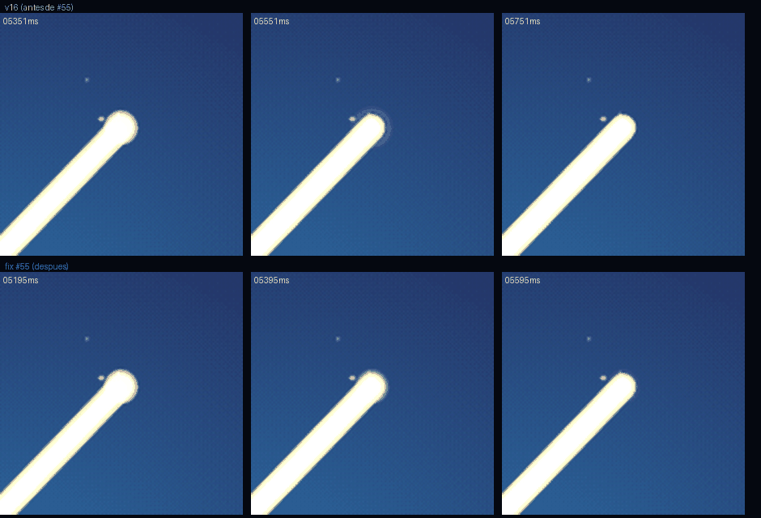

# Manual de estilo — Logo Triángulo-Espiral (issue #54)

> **Fuente única de verdad:** la geometría vive paramétrica en
> `tools/logo/geometry.mjs` (puerto verificado 1:1 contra el DOM aprobado de
> `proposals/logo-triangulo-espiral/aurea7.html` — gate
> `tools/logo/verify-dom-fidelity.mjs`). Todos los assets se **generan**;
> nunca se dibujan ni editan a mano.
>
> **ADR D1 RATIFICADO (2026-09-25, PR #58): la versión áurea v16 es el logo
> oficial.** La base v10 queda como referencia comparativa.

---

## 1. El símbolo

Espiral de conocimiento acumulativo: un triángulo que nace en el
origen —la supernova— y gira creciendo en generaciones hasta la C final en
plena intensidad (triángulo abierto = evolución en curso). Con
nodos-estrella en cada vértice: el símbolo es una constelación que se
expande.

- **Espiral**: nace en el origen y crece hacia afuera — opacidad y grosor
  crecientes: cada generación acumula más que la anterior. El conocimiento
  se expande.
- **Constelación**: cada nodo-estrella tiene su propio halo — radio
  aleatorizado con semilla fija y color característico heredado del nodo
  (radialGradient con currentColor: caída rápida, translúcida). Nodo y
  estrella se integran como una constelación real. En la animación las
  estrellas preexisten y se disuelven al ser tocadas por la línea; la
  supernova central permanece: es el origen de todo.
- **La C**: las dos últimas líneas del espiral, en oro, grosor máximo — la
  firma.
- **Jerarquía** (operador, 2026-09-25): el ojo va primero al origen — la
  supernova gana +2pt de core y las estrellas grandes de las aristas (la
  punta de la C + las bright) bajan ~22% para no robar protagonismo. Es
  tratamiento del render de marca; el spec de la animación (#53) no cambia
  (#55 puede espejarlo). → **Ya espejado**: `starSpec()` del artefacto y de
  `geometry.mjs` tienen los mismos valores, en el mismo orden (verificado al
  medir #55); el gate de fidelidad lo sigue cubriendo.

## 2. Versiones

| Versión | Generaciones | Internos | Giro entre internos | Estado |
|---|---|---|---|---|
| **base** (v10) | 5 | radio × 1.5 por vuelta | 4°/vuelta | referencia comparativa |
| **áurea** (v16) | 7 (6 internas + C) | distancia = C/φ por generación | 3°×φ = 4.854° | **canónica oficial** (ADR D1) |

Hecho geométrico verificado: el triángulo externo (la C) de la versión
áurea es **idéntico (0.0000 px)** al que la fórmula base produciría con 7
generaciones — el ancla de la C no se toca; sólo cambian los triángulos
internos. Respecto de la v10 (5 generaciones) el espiral completo queda
**+6° rotado horario** (2 vueltas más × 3°/vuelta) — es un hecho del
diseño aprobado, no un desvío.

## 3. Paleta

| Token | Hex | Uso |
|---|---|---|
| Teal (marca) | `#00c9c0` | punta del espiral (=`--teal` del sitio) |
| Oro (firma) | `#c9a84c` | la C y la tipografía (=`--gold`) |
| Azul profundo | `#16324f` | nacimiento del espiral |
| Night | `#050810` | fondo oscuro (=`--night`) |
| Espectro estelar | `#ff8a70` `#ff6f5e` `#ffb49e` `#f6d7c4` `#cfe0ff` | estrellas: rojizos dominantes + blancos cálidos + un azulado |
| Supernova | `#ffb3a0` | núcleo central permanente |

La rampa del espiral interpola `#16324f → #00c9c0` (22 → 0 R, 50 → 201 G,
79 → 192 B) con opacidad `0.10 → 0.72` y grosor `2.2 → 4.2`.

**Ambiente night aprobado** (no documentado antes — agregado por review
fresco): el HTML usa `--bg-0 #050810` y `--bg-1 #0b1120` (= `--deep` del
sitio) con un gradiente radial `radial-gradient(1100×780 @ 50% 38%,
#0b1120 → #050810 62%)` y un **halo teal** detrás del logo:
`radial-gradient(closest-side, rgba(0,201,192,.07), transparent 72%)`.
Los PNG dark (`*-dark`, og, apple-touch) reproducen ese ambiente — no son
fondo plano. Los tokens del sitio completos: `docs/STYLE_GUIDE.md`.

## 4. Construcción geométrica

Todos los valores viven en `CONFIG` (`tools/logo/geometry.mjs`):

| Parámetro | Valor | Nota |
|---|---|---|
| `center` | (400, 418) | centro del espiral en el lienzo 800×800 |
| `R` | 250 | radio de la punta de la C |
| `baseAngles` | A −90°, B 40°, C 140° | ángulos base del espiral; A arriba |
| `scalePerLoop` | 1.5 | crecimiento radial por vuelta (ancla) |
| `rotPerLoop` | 3° | giro horario por vuelta (ancla) |
| `globalRot` | 1° | rotación global del símbolo |
| `generations` | 7 (áurea) / 5 (base) | vueltas del espiral |
| `phi` | 1.618 | ratio áureo entre triángulos internos |
| `twistGolden` | 3°×φ ≈ 4.854° | giro entre internos (áurea) |
| `extendLast` | 0.01 | la punta se estira 1%: insinúa seguir evolucionando |
| `cWidth` | 10 | grosor de la C (glow = +6, blur 8, op .5) |

Medición del triángulo final (real, no la del comentario del HTML de
origen): lados 1.26/1.72/1.60 R, ángulos 44.6°/72.9°/62.6° — isósceles
aproximado, ápice ~44.6° en A. El comentario de la fuente dice “isósceles
más agudo: ápice ~50°”; en el manual vale la medición.

La C se dibuja como **un solo path** (`B→C→punta`) con `stroke-linejoin:
round`: el vértice en C es un join redondeado real, no dos caps montados.

**Verificación** (tests automáticos, `npx vitest run tools/logo/`):
ancla C ≡ fórmula base a 7 generaciones (0.0000 px), ratios internos = φ
exacto por generación, twist = 3°×φ, determinismo, y fidelidad DOM
(`node tools/logo/verify-dom-fidelity.mjs`).

## 5. Tipografía

| Elemento | Fuente | Tamaño (lienzo 800) | Tracking | Color |
|---|---|---|---|---|
| Nombre (lockup) | `ui-sans-serif, system-ui…` (idém proposal) | 21px | 0.42em = 8.82px | oro `#c9a84c` |
| Caption meta | ídem | — | 0.18em | `--ink-dim` |

En MAYÚSCULAS siempre. El sitio usa Playfair Display (display), Fira Code
(mono) y Cormorant Garamond (cuerpo) — el lockup del logo mantiene la sans
del sistema aprobada en la propuesta; cambiarla es decisión de marca, no
técnica.

## 6. Capas del SVG

`logo-{versión}-layers.svg` — 800×800, en este orden z:

1. **`logo-background`** — cielo: 30 estrellas ambient + 46 en brazos de
   galaxia espiral (mismo sentido de giro y crecimiento que el logo);
   semilla fija ⇒ idéntico en cada render.
2. **`logo-constellation`** — 22 estrellas de vértices (1 supernova central
   + 21 nodos); congeladas en pico (fotograma de máxima intensidad).
3. **`logo-spiral`** — 19 tramos con rampa de color/grosor/opacidad.
4. **`logo-c-triespiral`** — la C en oro: glow difuminado + trazo firme.

El **lockup** añade `logo-typography` (viewBox 800×940).

### Variantes de estrellas

| Variante | Qué muestra | Uso |
|---|---|---|
| **full** (layers) | constelación de vértices en pico + cielo + galaxia | hero, og-image, prints, masters |
| **settled** | el mark completo (espiral + C + supernova + cielo) SIN las estrellas de vértices — el estado final de la animación | contextos medianos |
| **favicon** (simplificado) | sólo la C + supernova, recortados al bbox — el mark completo es ilegible <24px | favicon 16/32, contextos <24px |

## 7. Uso correcto

- **Fondo**: night con el ambiente aprobado (gradiente radial `#0b1120 →
  #050810` + halo teal, ver §3) o transparente. Sobre fondos claros NO está
  diseñado (la rampa azul/teal y el oro se lavan): si es imprescindible, usar
  la variante print con la C y el espiral intactos y validar contraste.
- **Tamaño mínimo**: 24 px de alto para el mark completo. Los favicons 16/32
  usan la variante **simplificada** (sólo la C + supernova) — no el mark
  completo, que en <24px se vuelve ilegible.
- **Zona de respiro**: ≥ 12% del ancho del símbolo a cada lado.
- **No reemplazar** la tipografía del lockup por otra familia sin decisión
  de marca.
- **No alterar** colores, ángulos ni proporciones — regenerar desde
  `geometry.mjs` si hace falta otra variante.

## 8. Usos incorrectos

- ❌ Rotar, estirar o reflectar el símbolo.
- ❌ Recolorear la C (el oro es la firma) o aplanar el glow.
- ❌ Dibujar el símbolo a mano: **siempre regenerar** (`node
  tools/logo/generate-logo.mjs`).
- ❌ Editar los SVG/PNG generados — son OUTPUT; la fuente es `geometry.mjs`.
- ❌ Usar el full en <48px (el ruido de la constelación no se lee; usar
  settled).

## 9. ADR-lite D1 — versión canónica [RATIFICADA]

- **Contexto**: PR #53 dejó dos versiones estables (base v10, áurea v16).
  Los sub-issues #55 (pulir animación) y #56 (integración) dependen de la decisión.
- **Decisión**: **áurea v16** como logo oficial canónico.
- **Ratificación**: operador, 2026-09-25 (PR #58, sesión
  `logo-manual-svg-assets-54` — pi 01a0da49).
- **Razones de la propuesta**: ratios φ exactos y verificables por test; el
  ancla C es invariante (0.0000 px vs fórmula base); cielo sutil + galaxia más
  ricos pero discretos; arranque explosivo (stagger 110→235ms) mejor narrativa;
  7 generaciones dan más profundidad de espiral sin tocar la firma.
- **Consecuencias**: los assets `logo-aurea-*` son los oficiales;
  `logo-base-*` se conservan como referencia comparativa; #55 pule la
  animación sobre aurea7.html; #56 integra `logo-aurea-lockup` / favicons
  aurea en el sitio; #57 evalúa la CDN. El tag **v1.0.0** se crea
  **post-merge** sobre el commit de main (bump/tag = operador).
- **Si algún día se revirtiera**: regenerar con `--only-base` y re-etiquetar
  (el pipeline es paramétrico: cambiar el flag, no el código).

## 10. Inventario y regeneración

```
assets/brand/logo/
  logo-{aurea|base}-layers.svg        # master por capas (hero)
  logo-{aurea|base}-settled.svg       # estado final (favicons/print)
  logo-{aurea|base}-lockup.svg        # mark + tipografía (800×940)
  logo-{aurea|base}-{512|1024|2048|4096}.png       # transparente
  logo-{aurea|base}-{512|1024|2048|4096}-dark.png  # fondo night
  logo-{aurea|base}-print-{a4|a3}.png             # 300dpi transparente
  logo-{aurea|base}-print-{a4|a3}-dark.png        # 300dpi night
  favicon-{aurea|base}-{16|32}.png
  apple-touch-icon-{aurea|base}.png   # 180, fondo night
  og-image-{aurea|base}.png           # 1200×630 dark + nombre
```

Regenerar todo: `node tools/logo/generate-logo.mjs`
Sólo áurea/base: `--only-aurea` / `--only-base`
Salida alternativa: `LOGO_OUT=<dir>` o `--out <dir>`
Gate de fidelidad: `node tools/logo/verify-dom-fidelity.mjs`
Gate de movimiento: `node tools/logo/verify-motion.mjs` (ver §11)
Tests: `npx vitest run tools/logo/geometry.test.mjs`

**Nota sobre los print 300dpi**: el PNG está dimensionado para 300dpi
(A4 = 2480×3508 px ≙ 210×297 mm; A3 = 3508×4961 ≙ 297×420 mm) pero Chrome
no embede el metadato pHYs — al importarlo en InDesign/Illustrator setear
300 dpi manualmente.

QA visual de los exports: Chrome headless (`--headless --screenshot
--virtual-time-budget=N --window-size=WxH`), el mismo mecanismo que usó la
sesión de origen (PR #53) — reutilizado aquí para los PNG.

---

## 11. Movimiento (issue #55)

El cronograma vive **paramétrico** en `CONFIG.timing` de
`proposals/logo-triangulo-espiral/aurea7.html` — una sola fuente, y el gate de
movimiento lo **lee del artefacto** (no lo duplica).

### Cronograma y curvas

| Parámetro | Valor | Qué gobierna |
|---|---|---|
| `start` | 700ms | la constelación se ve primero; el espiral arranca después |
| `stagger` / `seg` | 235 / 460ms | ritmo **final** (el de la C) — *no se toca* (aprobado en #53) |
| `staggerFast` / `segFast` | 125 / 285ms | arranque explosivo (con un poco más de aire que en v16: 110/260) |
| `accelRamp` | 2.2 | exponente de la rampa explosivo→ritmo final |
| `segC` | 640ms | trazado de cada tramo de la C |
| `hotFade` | 500ms | el brillo de formación baja al chocar con su nodo |
| `settlePad` | 420ms | colchón entre el último trazo y la entrada del settle |
| `easeDraw` | `cubic-bezier(.19,1,.22,1)` | trazado (expo-out) |
| `easeDissolve` | `cubic-bezier(.3,1.4,.5,1)` | chispa elástica de las estrellas de las aristas |
| `easePunta` | `cubic-bezier(.33,.6,.4,1)` | apagado de la punta: **sin overshoot** |
| `easeGlow` | `ease-out` | encendido del glow de la C junto con su trazado |
| `constellation.dissolve` | 680ms | disolución de cada estrella al ser tocada |

**Regla de pico de brillo**: una transición de apagado no puede tener overshoot
(`y > 1` en su cubic-bezier) ni crecer en escala. `easeDissolve` sí tiene
overshoot: es la chispa de las aristas, decisión de diseño de #53. La **punta**
no lo tiene — es el cierre de la pieza y va limpio.

### El glow respira sobre el trazo, no sobre el grupo

`.settle-on .c-glow path` anima la respiración (`@keyframes breathe`, 3.6s,
`0,5 → 0,78`), y arranca exactamente en el valor con que el trazo venía
viéndose (0,5) ⇒ **no hay escalón al entrar el settle**. Sobre el grupo no
funciona: el grupo es el objetivo de la animación de trazado (que con
`fill: both` lo deja en 1 y le gana en la cascada), así que la respiración
quedaba **inerte** en v16.

### Cronograma sobre el reloj de animación

Los efectos posteriores (limpiar el `dash`, retirar las líneas de calor,
entrar al settle) se agendan con una micro-agenda sobre `requestAnimationFrame`
que compara `currentTime` de cada animación — **nunca con `setTimeout`**: un
timer de reloj de pared se desincroniza si la pestaña queda en background (donde
las animaciones sí se pausan) y, sobre todo, deja la pieza sin poder congelarse
(un fotograma con `pause + currentTime` no dispararía los efectos).
El fin del cronograma se publica como `g.clock`.

### Cómo se verifica

`node tools/logo/verify-motion.mjs` (o `npm run logo:motion`) — congela
fotogramas exactos con una sesión CDP (`pause` + `currentTime`) y mide:

- **sin pico de brillo** — estructural: opacidad monótona, escala que no crece,
sin overshoot en la curva de la punta;
- **sin bloom** — medido: la luz propia de la estrella (canal rojo sobre el
estado settled) y el glow **fuera del trazo** nunca suben mientras se apaga;
- **settle sin salto y respirando** — el cuerpo de la C no pega escalón a
±40ms del settle y el glow cambia al respirar (en v16 cambiaba 0.0000: no
respiraba);
- **autochequeos** — la estrella existe antes y no después, hay píxel brillante
en el settled, y el congelado no deriva del instante pedido.

Umbrales calibrados sobre la medición antes/después (ruido entre corridas con
fotogramas congelados ≤0.001). `--report` imprime la curva sin veredicto y
`--frames <dir>` guarda los fotogramas medidos.



### Lo que arregló #55 (medido)

1. **Destello sobre la punta**: la estrella de la punta se disolvía con
   `escala 1 → 1,3` y un easing con overshoot. A los 100ms de empezar ya había
caído al **32%** de su luz y a los 200ms al **12%**, dejando un halo rosado
*desprendido* sobre la C (columna de arriba de la imagen): eso es lo que se leía
como destello. Ahora el apagado es un fade puro y parejo — **52% a los 100ms,
18% a los 200ms, 8% a los 300ms**, monótono hasta 0, con núcleo y halo
saliendo juntos.
2. **Respiración inerte**: el `breathe` sobre el grupo nunca se veía (el cuerpo
de la C cambiaba **0,0000** entre settle+40 y settle+900). Ahora respira sobre
el trazo: **0,2182 → 0,2270 (+0,0088)**.
3. **Rampa del arranque**: `accelRamp` estaba implícito en un `|| 3`; ahora es
   parámetro declarado y bajó a **2,2**, y el arranque abrió un poco
(`staggerFast` 110 → 125ms, `segFast` 260 → 285ms): el tempo camina hacia el
ritmo final en vez de saltar a él — el contraste deja de leerse como brusco sin
perder el estallido (2 líneas trazando a la vez). El ritmo final (235/460ms) no
se tocó y la pieza dura lo mismo (fin de la disolución de la punta: 6031ms →
5976ms; settle 5771ms → 5716ms).

> La columna *v16* se reproduce corriendo el gate contra la versión de PR #53
> con el mismo plumbing del cronograma:
> `node tools/logo/verify-motion.mjs --html <v16.html>` → 4 violaciones;
> con el artefacto actual → 0.